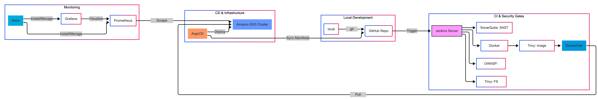

# DevSecOps Pipeline: Netflix Clone Deployment on Kubernetes

This project demonstrates a complete DevSecOps lifecycle for a Netflix clone application. It covers continuous integration, security scanning, monitoring, and automated deployment using GitOps principles.



## Project Architecture

The pipeline follows a strict **security-gate workflow** to ensure only clean, validated code reaches production:

```
Source Code → Jenkins CI → SonarQube (SAST) → OWASP (SCA) → Trivy (Container) → Argo CD → EKS
```

| Stage | Tool | Purpose |
|---|---|---|
| **1. Continuous Integration** | Jenkins | Automates the entire lifecycle |
| **2. Static Analysis** | SonarQube | Scans source code for bugs & security hotspots |
| **3. Dependency Scanning** | OWASP Dependency-Check | Checks dependencies for known CVEs (SCA) |
| **4. Container Security** | Trivy | Scans Docker filesystem and final image |
| **5. GitOps Deployment** | Argo CD | Syncs Kubernetes manifests to Amazon EKS |
| **6. Monitoring** | Prometheus & Grafana | Real-time cluster and Jenkins health metrics |

---

## Technology Stack

### Frontend
- **React.js** — UI Components
- **TMDB API** — Movie Data Source ([themoviedb.org](https://www.themoviedb.org))

### DevSecOps & CI/CD
- **Jenkins** — CI/CD Automation
- **SonarQube** — SAST Tool
- **Trivy** — Image/Filesystem Scanner
- **OWASP Dependency-Check** — Software Composition Analysis (SCA)
- **Docker** — Containerization

### Infrastructure & Monitoring
- **Amazon EKS** — Managed Kubernetes Service
- **Argo CD** — GitOps Controller
- **Helm** — Kubernetes Package Manager
- **Prometheus & Grafana** — Monitoring & Observability

---

## Deployment Guide

### Prerequisites

- AWS Account with CLI configured
- DockerHub repository
- TMDB API Key (obtain from [themoviedb.org](https://www.themoviedb.org))

---

### 1. Initial Server Setup (EC2)

Launch a **t2.large** instance (Ubuntu 22.04) for Jenkins and SonarQube.

```bash
# Update and install Docker
sudo apt update && sudo apt install docker.io -y
sudo usermod -aG docker jenkins && sudo chmod 666 /var/lib/docker.sock

# Install Trivy
sudo apt-get install wget apt-transport-https gnupg lsb-release
wget -qO - https://aquasecurity.github.io/trivy-repo/deb/public.key | sudo apt-key add -
sudo apt-get update && sudo apt-get install trivy -y
```

---

### 2. Kubernetes & GitOps Setup

Once your Amazon EKS cluster is ready, install Argo CD to manage deployments:

```bash
kubectl create namespace argocd
kubectl apply -n argocd -f https://raw.githubusercontent.com/argoproj/argo-cd/stable/manifests/install.yaml

# Expose the Argo CD UI via LoadBalancer
kubectl patch svc argocd-server -n argocd -p '{"spec": {"type": "LoadBalancer"}}'
```

---

### 3. Monitoring (Helm)

Deploy the Prometheus stack to monitor cluster nodes:

```bash
helm repo add prometheus-community https://prometheus-community.github.io/helm-charts
helm install prometheus prometheus-community/prometheus
```

---

## Environment Variables & Secrets

Configure the following credentials in **Jenkins → Manage Jenkins → Credentials**:

| Secret ID | Type | Description |
|---|---|---|
| `tmdb_api_key` | Secret Text | Your TMDB V3 API Key |
| `docker_hub_creds` | Username & Password | DockerHub login credentials |
| `sonar_token` | Secret Text | Token from SonarQube → Administration → Security |
| `mail_creds` | Secret Text | SMTP App Password for Gmail notifications |

---

## Monitoring Dashboards

Import the following Grafana dashboard IDs for instant observability:

| Dashboard | Grafana ID |
|---|---|
| Jenkins Metrics | `9964` |
| Node Exporter (Host Metrics) | `1860` |
| Kubernetes Cluster Health | Pre-configured via Prometheus |

---

## Troubleshooting

### Docker Push Fails
- Ensure you ran `sudo usermod -aG docker jenkins` and **restarted Jenkins** after.
- Verify DockerHub credentials are correctly configured in Jenkins.

### Blank Netflix Page
- This usually indicates the `TMDB_V3_API_KEY` was not passed correctly during the `docker build` stage.
- Check your `--build-arg` flags in the Jenkins pipeline build step.

### Argo CD Sync Failing
- Ensure the image tag in `kubernetes/deployment.yaml` **exactly matches** the tag pushed by Jenkins.
- Check Argo CD application logs: `kubectl logs -n argocd -l app.kubernetes.io/name=argocd-application-controller`
